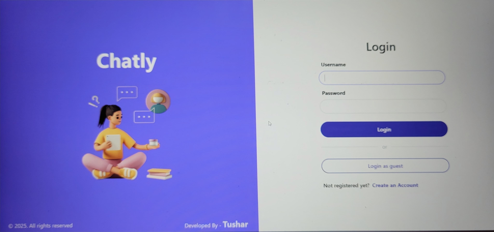

# 🚀 Realtime Chat App


## 🌟 Introduction
**Realtime Chat App** is a feature-rich chat application that allows users to send and receive messages instantly. It utilizes **Socket.io** for real-time communication, **Node.js** for the backend, and **React.js** for the frontend, creating a seamless and dynamic chat experience.

## 🔥 Features
✅ **Real-time messaging** using WebSockets  
✅ **User authentication** with JWT  
✅ **Online/offline status indicator**  
✅ **Private and group chat support**  
✅ **Custom user profiles**  
✅ **Media sharing (images, videos, and files)**  
✅ **Fully responsive UI**  
✅ **Typing indicators and read receipts**  

## 🛠️ Tech Stack
- **Frontend:** React.js, Tailwind CSS
- **Backend:** Node.js, Express.js
- **Database:** MongoDB
- **Real-time Communication:** Socket.io
- **Authentication:** JWT

## 🎯 Installation
### Clone the Repository
```bash
git clone https://github.com/Tusharxhub/realtime-chat-app-main.git
cd realtime-chat-app-main
```
### Install Dependencies
```bash
# Backend
cd server
npm install

# Frontend
cd client
npm install
```
### Start the Application
```bash
# Run Backend
cd server
npm start

# Run Frontend
cd client
npm start
```

## 📸 Screenshots


## 🚀 Deployment
The app can be deployed on platforms like **Vercel, Netlify (Frontend), and Render, Heroku (Backend)**.

## 🤝 Contributing
We welcome contributions! If you want to improve the project, follow these steps:
1. Fork the repo
2. Create a new branch (`git checkout -b feature-branch`)
3. Commit your changes (`git commit -m 'Added a new feature'`)
4. Push to the branch (`git push origin feature-branch`)
5. Open a Pull Request

## 📄 License
This project is licensed under the **MIT License**.

## 📬 Contact
🔗 **GitHub:** [Tusharxhub](https://github.com/Tusharxhub)  
📧 **Email:** t.k.d.dey2033929837@gmail.com  
📱 **Instagram:** [@tushardevx01](https://www.instagram.com/tushardevx01/)
